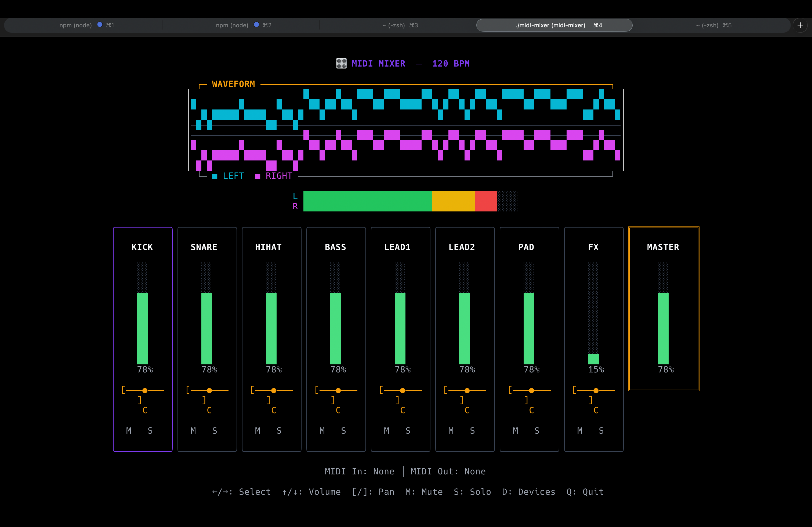

# MIDI Mixer TUI

A terminal-based MIDI mixer application built with Go, featuring 8 channel strips with volume faders, pan controls, mute/solo buttons, and bidirectional MIDI support.



## Features

- **8 Channel Strips** - Each with volume fader (CC7), pan control (CC10), mute and solo buttons
- **Master Fader** - Overall volume control
- **Bidirectional MIDI** - Receive CC messages from controllers, send changes to MIDI devices
- **Device Selection** - Choose MIDI input/output devices at runtime
- **Keyboard Navigation** - Full keyboard control for all mixer functions
- **Beautiful TUI** - Colorful terminal interface using Lipgloss styling

## Installation

### Prerequisites

- Go 1.21 or later
- RtMidi library (for MIDI support)

On macOS:
```bash
brew install rtmidi
```

On Linux (Debian/Ubuntu):
```bash
sudo apt-get install librtmidi-dev
```

### Build

```bash
go build -o midi-mixer .
```

### Run

```bash
./midi-mixer
```

## Controls

### Mixer View

| Key | Action |
|-----|--------|
| `←` / `→` or `h` / `l` | Select previous/next channel |
| `↑` / `↓` or `k` / `j` | Increase/decrease volume (±5) |
| `K` / `J` | Fine volume adjustment (±1) |
| `[` / `]` | Adjust pan left/right (±5) |
| `{` / `}` | Fine pan adjustment (±1) |
| `m` | Toggle mute on selected channel |
| `s` | Toggle solo on selected channel |
| `0` | Reset selected channel to defaults |
| `d` | Open device selection |
| `q` | Quit |

### Device Selection View

| Key | Action |
|-----|--------|
| `↑` / `↓` | Move selection up/down |
| `Tab` | Switch between Input/Output lists |
| `Enter` | Connect to selected devices |
| `r` | Refresh device list |
| `Esc` | Cancel and return to mixer |

## MIDI Mapping

The mixer uses standard MIDI CC numbers:

| Control | CC Number | Range |
|---------|-----------|-------|
| Channel Volume | CC 7 | 0-127 |
| Channel Pan | CC 10 | 0-127 (64 = center) |

MIDI channels 0-7 correspond to mixer channels 1-8.

## Architecture

```
midi-mixer/
├── main.go           # Application entry, Bubbletea model
├── midi/
│   └── midi.go       # MIDI device handling, CC messages
├── mixer/
│   └── state.go      # Mixer state, channel model
└── ui/
    ├── styles.go     # Lipgloss color palette & styles
    ├── components.go # Faders, channel strips, rendering
    └── devices.go    # Device selection UI
```

## Dependencies

- [Bubbletea](https://github.com/charmbracelet/bubbletea) - TUI framework
- [Lipgloss](https://github.com/charmbracelet/lipgloss) - Styling
- [gomidi/midi](https://gitlab.com/gomidi/midi) - MIDI library with RtMidi driver

## License

MIT
